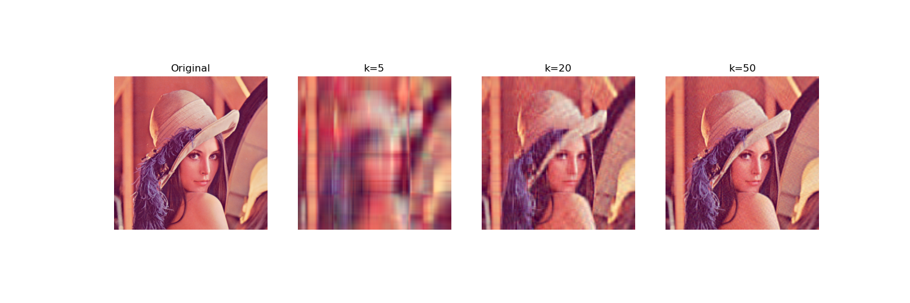

# Scientific Computing Codebase (1.0) - Updated 18/03/2026 Wednesday

This repository contains a collection of Python scripts demonstrating fundamental numerical linear algebra algorithms. It includes implementations for solving linear systems, matrix factorizations, and a practical application of Singular Value Decomposition (SVD) for image compression.

## Prerequisites

To run these scripts, you will need Python 3 installed on your machine along with a few external libraries. 

You can install the required dependencies using pip:
```bash
pip install numpy matplotlib
```

## Repository Structure

The scripts can be broadly categorized into three main areas: solving linear equations, matrix factorization, and practical applications.

### 1. Solving Linear Systems
These scripts are used to solve the equation $Ax = b$ for a given matrix $A$ and vector $b$.

*   **`gauss-elim.py`**
    *   **Description**: Solves $Ax = b$ using Gaussian Elimination with Partial Pivoting. Partial pivoting swaps rows to reduce floating-point rounding errors and handle zero pivots.
    *   **Usage**: Run the script and follow the interactive prompts to input the matrix dimension, coefficients, and the constant vector.

*   **`LU-decomp.py`**
    *   **Description**: Decomposes a square matrix $A$ into a Lower triangular matrix ($L$) and an Upper triangular matrix ($U$). It then uses forward and backward substitution to solve $Ax = b$.
    *   **Usage**: Interactive command-line prompts for matrix and vector inputs.

*   **`stdesc.py`**
    *   **Description**: Implements the Method of Steepest Descent, an iterative optimization algorithm used to solve systems of linear equations. 
    *   **Visualization**: For 2D systems, this script uses `matplotlib` to generate a contour plot showing the descent path alongside a loss convergence graph.

*   **`cgdesc.py`**
    *   **Description**: Implements the Conjugate Gradient Descent method, an iterative algorithm for solving symmetric positive-definite systems $Ax = b$. Converges significantly faster than Steepest Descent by constructing A-conjugate search directions.
    *   **Usage**: Interactive command-line prompts for the matrix $A$, vector $b$, initial guess $x_0$, and maximum number of iterations.
    *   **Visualization**: For 2D systems, generates a contour plot showing the conjugate gradient path alongside a loss convergence graph using `matplotlib`.

*   **`cgdesc_partitioned.py`**
    *   **Description**: Applies the Conjugate Gradient Descent method to a structured block-partitioned matrix. The user defines an $n \times n$ block $A_1$, and the script constructs a block tridiagonal system of size $kn \times kn$ (where $k$ is the number of blocks along one dimension) before solving it iteratively.
    *   **Usage**: Interactive prompts for the block dimension $n$, the number of blocks $k$, the entries of $A_1$, vector $b$, initial guess $x_0$, maximum iterations, and tolerance.
    *   **Visualization**: For 2D systems ($kn = 2$), generates a contour plot with the conjugate gradient path and a loss convergence graph using `matplotlib`.

### 2. Matrix Factorizations
These scripts decompose matrices into specific canonical forms.

*   **`qr-fact.py`**
    *   **Description**: Computes the QR factorization of a matrix using the Gram-Schmidt orthogonalization process. It decomposes a matrix $A$ into an orthogonal matrix $Q$ and an upper triangular matrix $R$.
    *   **Usage**: Prompts the user for matrix dimensions and space-separated entries.

*   **`svd-auto.py`**
    *   **Description**: A straightforward script demonstrating how to calculate the Singular Value Decomposition (SVD) of a matrix using NumPy's highly optimized built-in functions (`np.linalg.svd`).

*   **`svd-manual.py`**
    *   **Description**: Computes the SVD from scratch using the eigenvalues and eigenvectors of $A^T A$. It demonstrates the underlying mathematics of SVD without relying heavily on black-box functions.

### 3. Applications

*   **`svd-compression.py`**
    *   **Description**: A practical application of SVD. The script loads an image (`original.png`), separates its color channels, and compresses each channel by retaining only the top `k` singular values (e.g., $k=5, 20, 50$).
    *   **Output**: Generates a side-by-side visual comparison saved as `compression_comparison.png`.

## Image Compression Demonstration

By keeping only a small fraction of the largest singular values, we can approximate the original image with significantly less data.

**Original Image:**  
*(Requires an image named `original.png` in the same directory)*  


**Compression Results:**  
As $k$ (the number of singular values retained) increases, the clarity of the image returns. At $k=5$, the image is highly blocky, but by $k=50$, it closely resembles the original.  


## How to Run

Navigate to the directory containing the scripts and run any file using python:

```bash
python gauss-elim.py
```

For scripts that require inputs (`gauss-elim.py`, `LU-decomp.py`, `qr-fact.py`, `stdesc.py`, `cgdesc.py`, `cgdesc_partitioned.py`, `svd-manual.py`), simply follow the on-screen instructions. 

For the image compression script (`svd-compression.py`), ensure you have an image file named `original.png` in the same directory before execution.
